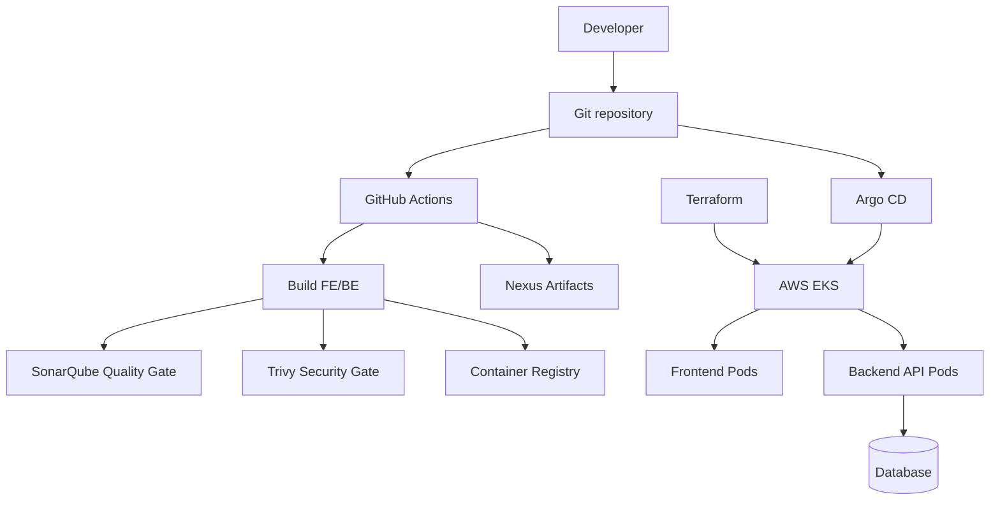
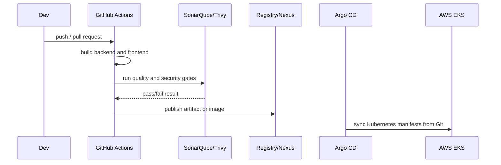

# Hospital EKS CI/CD GitOps Platform


This repository contains a hospital management application and the infrastructure files needed to run it on AWS EKS with a production-style DevOps layout.

## Project Structure

```text
.
  hospital_FE/             # React/Vite frontend
  hospital_BE/             # ASP.NET Core backend API
  k8s/                     # Kubernetes manifests and kustomize base
  argocd/                  # Argo CD application and setup notes
  .github/workflows/       # GitHub Actions workflows and CI/CD setup guide
  terraform/               # AWS EKS infrastructure as code
  security/                # SonarQube, Nexus, and Trivy setup
  docker-compose.yml       # Local app build/run helper
  hospital_db.sql          # Database bootstrap script
  DIAGRAM.drawio           # Architecture diagram source
```

## Architecture



## Delivery Workflow



## Main Components

| Area | Path | Purpose |
|---|---|---|
| Frontend | `hospital_FE/` | React/Vite web application served by nginx container. |
| Backend | `hospital_BE/Hospital_API/` | ASP.NET Core API for hospital workflows. |
| Kubernetes | `k8s/base/` | Deployments, services, namespace, and network policies. |
| GitOps | `argocd/` | Argo CD `Application` that syncs Kubernetes manifests. |
| CI/CD | `.github/workflows/` | GitHub Actions build, scan, image, and GitOps pipeline. |
| Infrastructure | `terraform/` | Modular AWS EKS and VPC provisioning. |
| Security Tooling | `security/` | SonarQube, Nexus, and Trivy setup with secure defaults. |

## Local Development

Run both application containers locally:

```bash
docker compose up --build
```

Default local ports:

| Service | URL |
|---|---|
| Frontend | `http://localhost:5173` |
| Backend | `http://localhost:5247` |

## Infrastructure Setup

Install prerequisites:

- AWS CLI v2
- Terraform `>= 1.6`
- kubectl
- Docker

Configure AWS credentials:

```bash
aws configure
```

Deploy dev infrastructure:

```bash
cd terraform/environments/dev
cp terraform.tfvars.example terraform.tfvars
terraform init
terraform plan -out tfplan
terraform apply tfplan
aws eks update-kubeconfig --region us-east-1 --name hospital-dev-eks
```

For production, use `terraform/environments/prod` and restrict `public_access_cidrs` before applying.

## Kubernetes Deployment

Create required runtime secrets:

```bash
kubectl -n hospital create secret generic be-db-secret \
  --from-literal=default-connection='Server=<host>;Database=<db>;User Id=<user>;Password=<password>;TrustServerCertificate=True'
```

Apply manually:

```bash
kubectl apply -k k8s/base
```

Or let Argo CD sync from `argocd/hospital-traefik-app.yaml`.

## Argo CD

Apply the Argo CD application:

```bash
kubectl apply -f argocd/hospital-traefik-app.yaml
```

Check sync:

```bash
kubectl -n argocd get applications
kubectl get pods,svc -n hospital
```

More details are in `argocd/README.md` and `argocd/SETUP.md`.

## DevSecOps Security Stack

The `security/` folder contains setup for the supporting security servers:

| Tool | Default local URL | Purpose |
|---|---|---|
| SonarQube | `http://127.0.0.1:9000` | Static code analysis and quality gate. |
| Nexus | `http://127.0.0.1:8081` | Private artifact and dependency repository. |
| Trivy | CLI | Vulnerability, secret, IaC, and misconfiguration scanning. |

Start SonarQube and Nexus:

```bash
cd security
docker compose up -d
```

Recommended pipeline gate:

```text
Build -> Test -> SonarQube -> Trivy -> Publish Artifact/Image -> Argo CD Deploy
```

For public access, put these services behind HTTPS and restrict inbound traffic to trusted IPs or CI servers.

## Production Notes

- Keep application workloads in private subnets.
- Restrict EKS API public access to trusted IPs.
- Store database passwords and tokens outside Git.
- Keep SonarQube/Nexus admin passwords and tokens in CI secrets only.
- Use immutable image tags in release pipelines.
- Review Terraform plans before applying to production.
- Prefer GitOps changes through Git instead of manual `kubectl edit`.

## Documentation Index

- `terraform/README.md`: infrastructure workflow and module layout
- `terraform/environments/dev/README.md`: dev environment setup
- `terraform/environments/prod/README.md`: production environment setup
- `k8s/README.md`: Kubernetes manifests and secrets
- `argocd/README.md`: GitOps deployment
- `.github/workflows/README.md`: GitHub Actions CI/CD and self-hosted runner setup
- `security/README.md`: DevSecOps security stack overview
- `security/sonarqube/README.md`: SonarQube token, webhook, and scanner setup
- `security/nexus/README.md`: Nexus repositories and credential handling
- `security/trivy/README.md`: vulnerability and IaC scanning
- `hospital_FE/README.md`: frontend notes
- `hospital_BE/README.md`: backend notes
