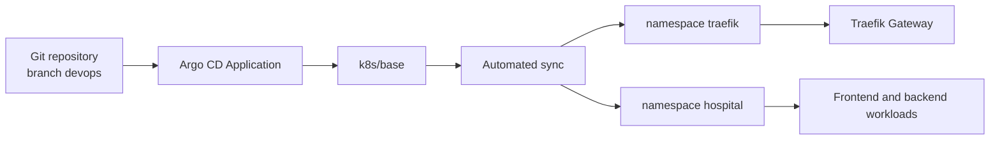
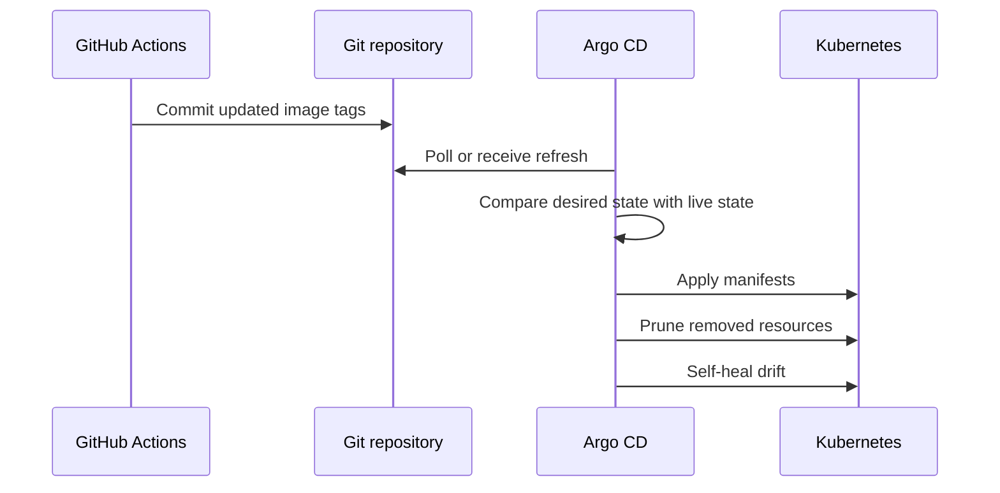

# Argo CD GitOps


This folder contains the Argo CD `Application` that continuously deploys the Kubernetes runtime stack from Git.

Argo CD is the desired-state controller for the cluster. Git is the source of truth, and manual cluster changes may be reverted when self-heal is enabled.

## Architecture



## Files

| File | Purpose |
|---|---|
| `hospital-traefik-app.yaml` | Argo CD Application for the Hospital Kubernetes stack. |
| `SETUP.md` | Step-by-step Argo CD installation notes. |
| `images/` | Documentation images. |

## Application Configuration

| Setting | Value |
|---|---|
| Repository | `https://github.com/Kien-devops/eks-cicd-argocd-sec-monitor.git` |
| Target revision | `devops` |
| Manifest path | `k8s/base` |
| Destination server | `https://kubernetes.default.svc` |
| Destination namespace | `hospital` |
| Automated sync | Enabled |
| Prune | Enabled |
| Self-heal | Enabled |

## Deployment Flow



## Apply the Application

Run on a host with cluster access:

```bash
kubectl apply -f argocd/hospital-traefik-app.yaml
```

## Access the Argo CD UI

Port-forward the API server:

```bash
kubectl port-forward svc/argocd-server -n argocd 8080:443 --address 0.0.0.0
```

Open:

```text
https://<server-ip>:8080
```

Get the initial admin password:

```bash
kubectl -n argocd get secret argocd-initial-admin-secret -o jsonpath="{.data.password}" | base64 -d
echo
```

## Verify Sync

```bash
kubectl -n argocd get applications
kubectl -n argocd describe application hospital-traefik-app
kubectl get pods -n hospital
kubectl get pods -n traefik
kubectl get gateway,httproute -n hospital
```

If you use the Argo CD CLI:

```bash
argocd app get hospital-traefik-app
argocd app sync hospital-traefik-app
```

## Operational Notes

| Topic | Guidance |
|---|---|
| Manual edits | Avoid `kubectl edit` for managed resources. Commit the change to Git instead. |
| Runtime secrets | Keep secrets such as `be-db-secret` created separately in the cluster. |
| Image deployment | GitHub Actions updates image tags in Git, then Argo CD syncs. |
| Drift | Self-heal will bring live resources back to Git state. |
| Prune | Deleted manifests can delete live resources during sync. Review changes carefully. |

## Troubleshooting

| Symptom | Check |
|---|---|
| Application is OutOfSync | Review changed resources and sync status. |
| Application is Degraded | Inspect pod status, events, and CRD readiness. |
| Sync fails on Gateway resources | Gateway API CRDs and Traefik CRDs must exist. |
| Image pull errors after sync | ECR secret, ECR tag, worker registry access. |
| Manual changes disappear | Expected behavior when self-heal is enabled. |
