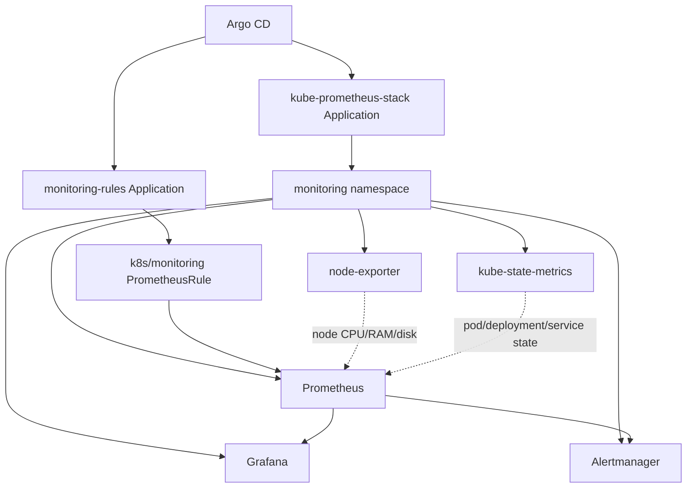

# Monitoring GitOps Applications


This folder contains Argo CD `Application` manifests for installing and managing the EKS monitoring stack.

These files are the GitOps installer layer. The runtime monitoring configuration lives in `k8s/monitoring`.

```text
argocd/monitoring = install/manage Prometheus, Grafana, Alertmanager
k8s/monitoring    = namespace and Prometheus alert rules used by the monitoring stack
```

## Files

| File | Purpose |
|---|---|
| `10-kube-prometheus-stack-app.yaml` | Tells Argo CD to install Prometheus, Grafana, Alertmanager, node-exporter, and kube-state-metrics from Helm. |
| `20-monitoring-rules-app.yaml` | Tells Argo CD to sync `k8s/monitoring`, including namespace and custom hospital workload alerts. |

## Model



## Apply Order

Install the Helm chart first so the Prometheus Operator CRDs exist, then apply the custom rules:

```bash
kubectl apply -f argocd/monitoring/10-kube-prometheus-stack-app.yaml
kubectl apply -f argocd/monitoring/20-monitoring-rules-app.yaml
```

Flow:

```text
kubectl apply argocd/monitoring/10-kube-prometheus-stack-app.yaml
-> Argo CD installs kube-prometheus-stack into monitoring
-> Prometheus, Grafana, Alertmanager, node-exporter, and kube-state-metrics run

kubectl apply argocd/monitoring/20-monitoring-rules-app.yaml
-> Argo CD syncs k8s/monitoring
-> Prometheus uses the custom hospital alert rules
```

## Access Grafana

```bash
kubectl port-forward -n monitoring svc/kube-prometheus-stack-grafana 3000:80
```

Open:

```text
http://localhost:3000
```

Get the admin password:

```bash
kubectl get secret -n monitoring kube-prometheus-stack-grafana -o jsonpath="{.data.admin-password}" | base64 -d
echo
```

## Verify

```bash
kubectl get applications -n argocd
kubectl get pods -n monitoring
kubectl get prometheus,alertmanager -n monitoring
kubectl get prometheusrule -n monitoring
kubectl get servicemonitor -A
```

## Notes

- Grafana is kept as `ClusterIP` for dev safety. Use port-forward first.
- Prometheus retention is set to `7d` for a lightweight dev cluster.
- Grafana persistence is disabled for dev. Enable it before treating dashboards as long-lived data.
- For production, pin the Helm chart to an exact reviewed version instead of the open version range.
