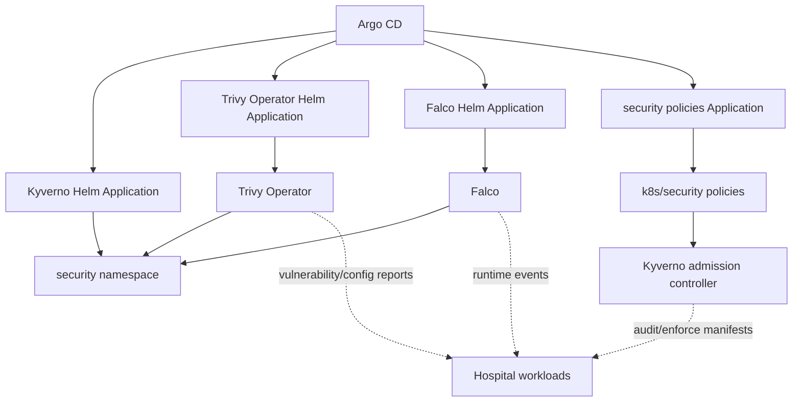

# Security GitOps Applications


This folder contains Argo CD `Application` manifests for installing and managing the EKS security stack.

These files are the GitOps installer layer. The runtime security configuration lives in `k8s/security`.

```text
argocd/security = install/manage Kyverno, Trivy Operator, and Falco
k8s/security    = namespace and Kyverno policies used by the security stack
```

## Files

| File | Purpose |
|---|---|
| `00-security-namespace-policies-app.yaml` | Tells Argo CD to sync `k8s/security`, including namespace and Kyverno policies. |
| `10-kyverno-app.yaml` | Tells Argo CD to install Kyverno from the official Helm chart. |
| `20-trivy-operator-app.yaml` | Tells Argo CD to install Trivy Operator from the Aqua Helm chart. |
| `30-falco-app.yaml` | Tells Argo CD to install Falco from the Falco Security Helm chart. |

## Model



## Apply Order

Install Kyverno first, then apply the policies and remaining tools:

```bash
kubectl apply -f argocd/security/10-kyverno-app.yaml
kubectl apply -f argocd/security/00-security-namespace-policies-app.yaml
kubectl apply -f argocd/security/20-trivy-operator-app.yaml
kubectl apply -f argocd/security/30-falco-app.yaml
```

Flow:

```text
kubectl apply argocd/security/10-kyverno-app.yaml
-> Argo CD installs Kyverno into security

kubectl apply argocd/security/00-security-namespace-policies-app.yaml
-> Argo CD syncs k8s/security
-> Kyverno uses those policies to audit workloads

kubectl apply argocd/security/20-trivy-operator-app.yaml
-> Argo CD installs Trivy Operator for vulnerability/config reports

kubectl apply argocd/security/30-falco-app.yaml
-> Argo CD installs Falco for runtime detection
```

## Verify

```bash
kubectl get applications -n argocd
kubectl get pods -n security
kubectl get clusterpolicy
kubectl get vulnerabilityreports -A
kubectl logs -n security -l app.kubernetes.io/name=falco
```

## Notes

- The Kyverno policies start in `Audit` mode to avoid breaking existing workloads.
- Move policies to `Enforce` only after current manifests pass the audit reports.
- For production, pin each Helm chart to an exact reviewed version instead of the open version range.
