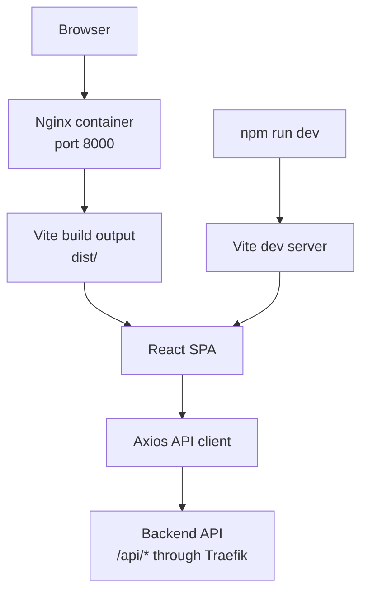
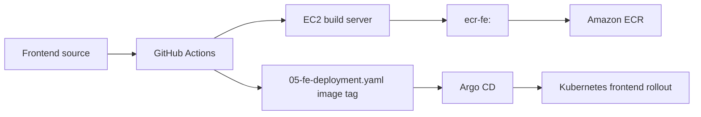

# Hospital Frontend


This folder contains the Hospital web frontend. It is a React 19 single-page application built with Vite and served in production by Nginx.

The frontend provides patient-facing pages, authentication pages, appointment flows, hospital content pages, and administrative screens for managing hospital operations.

## Architecture



## Tech Stack

| Area | Tool |
|---|---|
| Framework | React 19 |
| Build tool | Vite 6 |
| Routing | React Router DOM 7 |
| HTTP client | Axios |
| UI libraries | Ant Design, React Bootstrap, Bootstrap, React Icons, Font Awesome |
| Charts | Chart.js, react-chartjs-2 |
| Rich text | TinyMCE React |
| Production runtime | Nginx Alpine |

## Source Structure

| Path | Purpose |
|---|---|
| `src/main.jsx` | React entry point. |
| `src/App.jsx` | Application route composition. |
| `src/pages/` | Public, patient, auth, and admin pages. |
| `src/pages/admin/` | Administrative management screens. |
| `src/components/` | Shared UI components. |
| `src/components/auth/` | Route/auth guard components. |
| `src/components/layout/` | Header, footer, and layout pieces. |
| `src/services/api.js` | Axios API integration. |
| `src/contexts/` | React context providers. |
| `src/utils/` | Shared frontend utilities. |
| `src/data/` | Mock data used by selected UI screens. |
| `Dockerfile` | Multi-stage production image build. |

## Local Development

Install dependencies:

```bash
cd hospital_FE
npm install
```

Start Vite:

```bash
npm run dev
```

Build production assets:

```bash
npm run build
```

Run lint:

```bash
npm run lint
```

Preview the production build:

```bash
npm run preview
```

## API Configuration

The application calls the backend through Axios from `src/services/api.js`. In the deployed environment, public API requests should use the same domain with the `/api` prefix:

```text
https://benhvien.teamdevops.shop/api/*
```

For local development, confirm the API base URL in `src/services/api.js` and align it with the backend URL you are running locally.

## Docker

Build the image:

```bash
cd hospital_FE
docker build -t hospital-fe .
```

Run it locally:

```bash
docker run --rm -p 5173:8000 hospital-fe
```

Open:

```text
http://localhost:5173
```

The Dockerfile uses two stages:

1. `node:22-alpine` builds static files into `dist/`.
2. `nginx:1.27-alpine` serves the app on port `8000`.

The production container listens on `8000` so it can run as the non-root `nginx` user.

## Kubernetes Deployment

The frontend is deployed by:

```text
k8s-traefik-lb-demo/k8s/05-fe-deployment.yaml
k8s-traefik-lb-demo/k8s/06-fe-service.yaml
```

Runtime details:

| Setting | Value |
|---|---|
| Deployment | `fe-deployment-v1` |
| Namespace | `hospital` |
| Replicas | `2` |
| Container port | `8000` |
| Service | `fe-service-v1` |
| Image | `606030503959.dkr.ecr.us-east-1.amazonaws.com/ecr-fe:<git-sha>` |

Public route:

```text
https://benhvien.teamdevops.shop/
```

## CI/CD



## Verification

Local:

```bash
npm run build
docker build -t hospital-fe .
docker run --rm -p 5173:8000 hospital-fe
curl -I http://localhost:5173
```

Kubernetes:

```bash
kubectl -n hospital get deploy fe-deployment-v1
kubectl -n hospital get pods -l app=fe-v1 -o wide
kubectl -n hospital logs deployment/fe-deployment-v1 -c fe-v1 --tail=100
curl -I https://benhvien.teamdevops.shop
```

## Troubleshooting

| Symptom | Check |
|---|---|
| Vite dev server fails | Node version, `npm install`, package lock consistency. |
| Production container returns 403 or 404 | Nginx config, built `dist/` output, container port `8000`. |
| API calls fail in browser | API base URL, CORS behavior, Traefik `/api` route, backend pod status. |
| Kubernetes image pull fails | ECR tag, `ecr-registry-secret`, worker access to ECR. |
| Page works locally but not through domain | HAProxy, Traefik Gateway, frontend service endpoints. |
