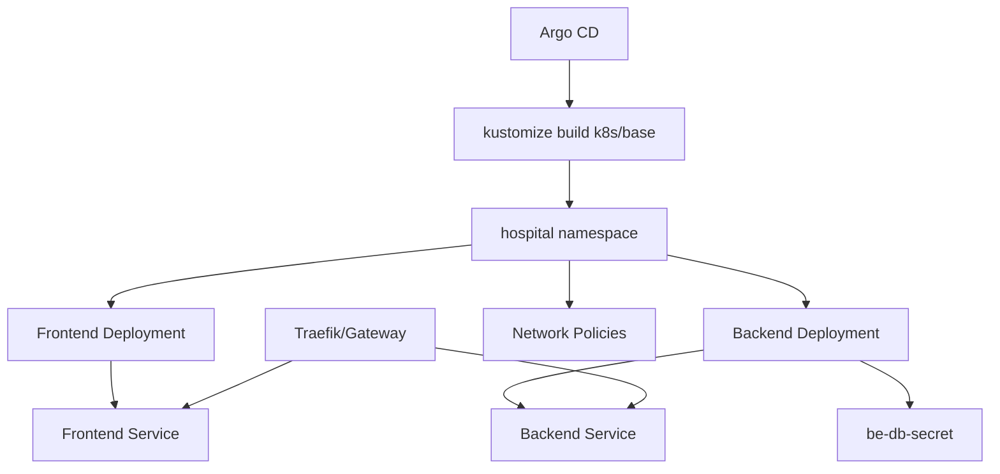
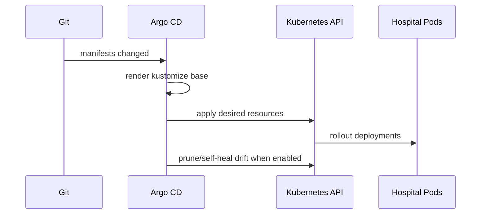

# Kubernetes Manifests


This folder contains the Kubernetes runtime manifests deployed by Argo CD.

## Architecture



## Deployment Workflow



## Structure

```text
k8s/
  base/
    namespace.yaml
    kustomization.yaml
    05-fe-deployment.yaml
    06-fe-service.yaml
    07-be-deployment.yaml
    08-be-service.yaml
    10-network-policy.yaml
```

## Apply Manually

```bash
kubectl apply -k k8s/base
```

## Required Secrets

Create these before deploying the backend:

```bash
kubectl -n hospital create secret generic be-db-secret \
  --from-literal=default-connection='Server=<host>;Database=<db>;User Id=<user>;Password=<password>;TrustServerCertificate=True'
```

If images are private in ECR, create an image pull secret or configure worker node IAM/ECR access:

```bash
kubectl -n hospital create secret docker-registry ecr-registry-secret \
  --docker-server=<account-id>.dkr.ecr.<region>.amazonaws.com \
  --docker-username=AWS \
  --docker-password="$(aws ecr get-login-password --region <region>)"
```

## Verify

```bash
kubectl get pods,svc -n hospital
kubectl describe deploy be-deployment-v1 -n hospital
kubectl describe deploy fe-deployment-v1 -n hospital
```
