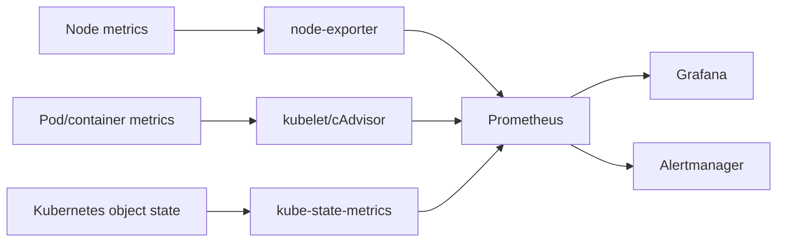

# EKS Monitoring Stack


This folder contains the Kubernetes monitoring baseline for the EKS cluster.

These files are runtime configuration used after the monitoring tools are installed by Argo CD from `argocd/monitoring`.

```text
argocd/monitoring = install/manage monitoring tools
k8s/monitoring    = configure monitoring inside the cluster
```

## Components

| Component | Purpose |
|---|---|
| `monitoring` namespace | Shared namespace for Prometheus, Grafana, and Alertmanager. |
| PrometheusRule | Custom workload alerts for the hospital namespaces. |
| kube-prometheus-stack | Installed by Argo CD from Helm in `argocd/monitoring`. Provides Prometheus, Grafana, Alertmanager, node-exporter, and kube-state-metrics. |

## Metrics Source Model



This project does not require application `/metrics` endpoints for the current monitoring baseline. It focuses on node, pod, container, Deployment, and Kubernetes object metrics.

## Apply Namespace And Rules

Install `kube-prometheus-stack` first so the `PrometheusRule` CRD exists.

```bash
kubectl apply -k k8s/monitoring
```

## Access Grafana

```bash
kubectl port-forward -n monitoring svc/kube-prometheus-stack-grafana 3000:80
```

Open:

```text
http://localhost:3000
```

Get the admin password:

```bash
kubectl get secret -n monitoring kube-prometheus-stack-grafana -o jsonpath="{.data.admin-password}" | base64 -d
echo
```

## Useful Checks

```bash
kubectl get pods -n monitoring
kubectl get prometheus,alertmanager -n monitoring
kubectl get prometheusrule -n monitoring
kubectl get servicemonitor -A
```
