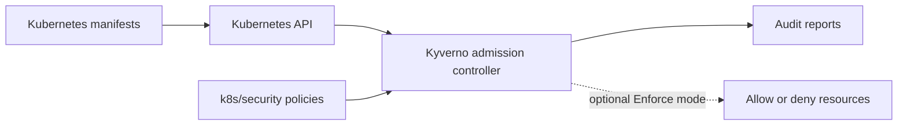

# EKS Security Stack


This folder contains the Kubernetes security baseline for the EKS cluster.

These files are runtime configuration used after the security tools are installed by Argo CD from `argocd/security`.

```text
argocd/security = install/manage security tools
k8s/security    = configure security inside the cluster
```

## Components

| Component | Purpose |
|---|---|
| `security` namespace | Shared namespace for security tools. |
| Kyverno policies | Audit unsafe workload configuration before switching to enforce mode. |
| Kyverno | Admission policy engine. Installed by Argo CD from Helm in `argocd/security`. |
| Trivy Operator | Vulnerability and configuration reports inside the cluster. Installed by Argo CD from `argocd/security`. |
| Falco | Runtime threat detection. Installed by Argo CD from `argocd/security`. |

## Policy Model



## Apply Namespace And Policies

Kyverno must be installed before applying the policies.

```bash
kubectl apply -k k8s/security
```

## Policy Mode

Policies start in `Audit` mode so they report issues without blocking current workloads.

After the app manifests are cleaned up, change:

```yaml
validationFailureAction: Audit
```

to:

```yaml
validationFailureAction: Enforce
```

## Useful Checks

```bash
kubectl get pods -n security
kubectl get clusterpolicy
kubectl get policyreport -A
kubectl get vulnerabilityreports -A
kubectl get configauditreports -A
kubectl logs -n security -l app.kubernetes.io/name=falco
```
