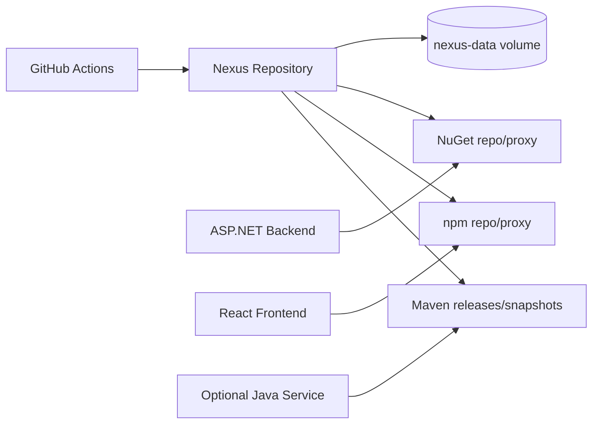
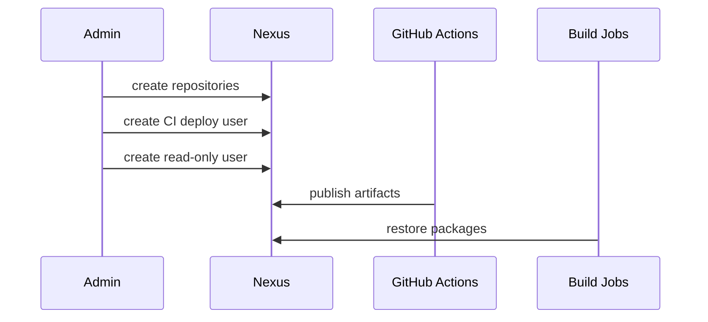

# Nexus Repository Setup


Nexus is used as a private artifact repository and dependency proxy for CI/CD.

## Architecture



## Repository Model

| Repository | Format | Purpose |
|---|---|---|
| `nuget-hosted` | NuGet | Internal .NET packages. |
| `nuget-group` | NuGet | Group hosted + proxy feeds. |
| `npm-hosted` | npm | Internal frontend packages. |
| `npm-group` | npm | Group hosted + proxy registries. |
| `maven-releases` | Maven | Release artifacts for Java services. |
| `maven-snapshots` | Maven | Snapshot artifacts for Java services. |

## Start

```bash
cd security
docker compose up -d nexus
docker compose ps nexus
```

Open:

```text
http://127.0.0.1:8081
```

## First Login

Get admin password:

```bash
docker exec -it nexus cat /nexus-data/admin.password
```

Login:

| Field | Value |
|---|---|
| Username | `admin` |
| Password | value from `/nexus-data/admin.password` |

Change the admin password immediately.

Local placeholders:

```text
security/nexus/.env
```

## Setup Workflow



Recommended steps:

1. Disable anonymous access unless internal read-only access is required.
2. Create repository formats used by the project.
3. Create a CI deploy account.
4. Store Nexus credentials in GitHub Actions secrets.
5. Configure package managers to use Nexus group repositories.

## NuGet Example

Add source:

```bash
dotnet nuget add source https://nexus.example.com/repository/nuget-group/ \
  --name nexus-nuget \
  --username "$NEXUS_USERNAME" \
  --password "$NEXUS_PASSWORD" \
  --store-password-in-clear-text
```

Push package:

```bash
dotnet nuget push "*.nupkg" \
  --source https://nexus.example.com/repository/nuget-hosted/ \
  --api-key "$NEXUS_API_KEY"
```

## npm Example

```bash
npm config set registry https://nexus.example.com/repository/npm-group/
npm login --registry=https://nexus.example.com/repository/npm-hosted/
```

## Maven Example

For Java services, use:

```text
security/examples/nexus-maven-distribution-management.xml
```

Replace `https://nexus.example.com` with your Nexus domain.

## Verify

```bash
docker compose ps nexus
docker compose logs --tail=100 nexus
```

In the UI:

- create or confirm hosted/proxy/group repositories
- confirm CI user permissions
- test package restore from a CI runner

## Security Checklist

- Use HTTPS for all repository traffic.
- Keep anonymous access disabled unless explicitly needed.
- Use separate deploy and read-only accounts.
- Keep admin credentials out of CI jobs.
- Back up `nexus-data` before upgrades.

