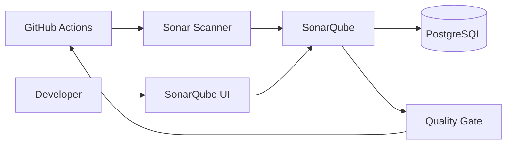
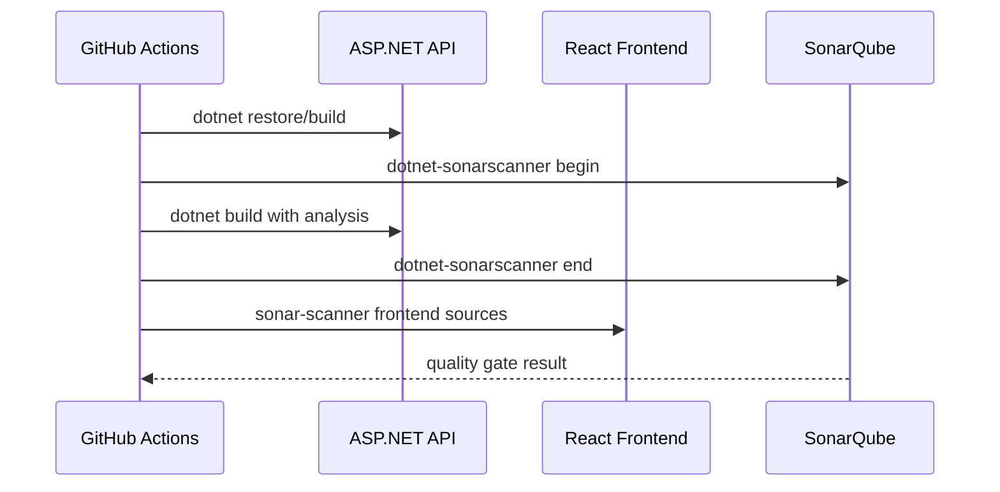

# SonarQube Setup


SonarQube is used for static code analysis, maintainability checks, security hotspots, and CI quality gates.

## Architecture



## Runtime Model

| Component | Container | Purpose |
|---|---|---|
| SonarQube | `sonarqube` | Web UI, analysis API, quality gate engine. |
| PostgreSQL | `sonarqube-db` | Persistent SonarQube database. |
| GitHub Actions | `.github/workflows/cicd.yml` | Runs analysis and reads gate status. |

## Start

```bash
cd security
docker compose up -d sonarqube-db sonarqube
docker compose ps
```

Open:

```text
http://127.0.0.1:9000
```

Default first login:

| Field | Value |
|---|---|
| Username | `admin` |
| Password | `admin` |

Change the password immediately after first login.

## Generate Token

Go to:

```text
Administration > Security > Users > Tokens
```

Create a token:

| Field | Value |
|---|---|
| Name | `sonar-token` |
| Type | User token |
| Expires | Choose a rotation period |

Store the generated token in GitHub Actions secrets or another secret manager.

## GitHub Actions Workflow

Add repository secrets:

```text
SONAR_HOST_URL=https://sonarqube.example.com
SONAR_TOKEN=<generated-sonarqube-token>
```

Workflow model:



Use secrets in workflow jobs:

```yaml
env:
  SONAR_HOST_URL: ${{ secrets.SONAR_HOST_URL }}
  SONAR_TOKEN: ${{ secrets.SONAR_TOKEN }}
```

Local placeholders:

```text
security/sonarqube/.env
```

## ASP.NET Core Analysis

Install scanner:

```bash
dotnet tool install --global dotnet-sonarscanner
```

Run from the repository root:

```bash
dotnet sonarscanner begin \
  /k:"hospital-api" \
  /d:sonar.host.url="$SONAR_HOST_URL" \
  /d:sonar.token="$SONAR_TOKEN"

dotnet build hospital_BE/Hospital_API/Hospital_API.csproj --configuration Release

dotnet sonarscanner end /d:sonar.token="$SONAR_TOKEN"
```

## React/Vite Analysis

```bash
sonar-scanner \
  -Dsonar.projectKey=hospital-frontend \
  -Dsonar.sources=hospital_FE/src \
  -Dsonar.exclusions=**/node_modules/**,**/dist/** \
  -Dsonar.host.url="$SONAR_HOST_URL" \
  -Dsonar.token="$SONAR_TOKEN"
```

Example properties file:

```text
security/sonarqube/sonar-project.frontend.properties.example
```

## Verify

```bash
docker compose ps sonarqube sonarqube-db
docker compose logs --tail=100 sonarqube
```

Check in the UI:

- project appears after first analysis
- quality gate status is computed
- issues and security hotspots are visible

## Security Checklist

- Keep SonarQube behind HTTPS before exposing it outside the server.
- Restrict inbound traffic to trusted IPs or self-hosted runners.
- Use one token per CI system.
- Rotate tokens regularly.
- Back up PostgreSQL and SonarQube data volumes before upgrades.

