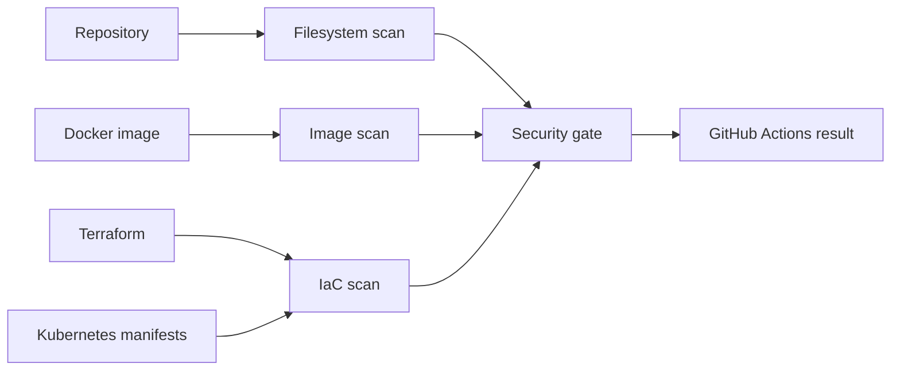
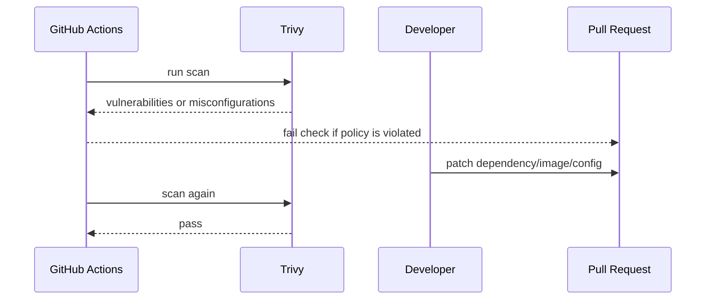

# Trivy Setup


Trivy scans container images, filesystems, dependency manifests, Kubernetes YAML, Terraform code, secrets, and common misconfigurations.

## Workflow



## Policy

Local scan defaults:

```text
security/trivy/.env
security/trivy/trivy.yaml.example
```

Recommended CI gate:

| Scan | Severity | Exit |
|---|---|---|
| Filesystem/dependencies | `HIGH,CRITICAL` | fail on finding |
| Terraform/Kubernetes config | `HIGH,CRITICAL` | fail on finding |
| Container image | `HIGH,CRITICAL` | fail on finding |
| Secrets | enabled | review immediately |

## Install

Ubuntu:

```bash
sudo apt-get update
sudo apt-get install -y wget apt-transport-https gnupg lsb-release
wget -qO - https://aquasecurity.github.io/trivy-repo/deb/public.key | sudo gpg --dearmor -o /usr/share/keyrings/trivy.gpg
echo "deb [signed-by=/usr/share/keyrings/trivy.gpg] https://aquasecurity.github.io/trivy-repo/deb $(lsb_release -sc) main" | sudo tee /etc/apt/sources.list.d/trivy.list
sudo apt-get update
sudo apt-get install -y trivy
trivy --version
```

Docker alternative:

```bash
docker run --rm aquasec/trivy:latest --version
```

## Scan Repository

```bash
trivy fs --severity HIGH,CRITICAL --exit-code 1 .
```

## Scan Kubernetes Manifests

```bash
trivy config --severity HIGH,CRITICAL --exit-code 1 k8s/base
```

## Scan Terraform

```bash
trivy config --severity HIGH,CRITICAL --exit-code 1 terraform
```

## Scan Docker Images

```bash
trivy image --severity HIGH,CRITICAL --exit-code 1 <image>:<tag>
```

Examples:

```bash
trivy image --severity HIGH,CRITICAL --exit-code 1 hospital-dev-frontend:latest
trivy image --severity HIGH,CRITICAL --exit-code 1 hospital-dev-backend:latest
```

## GitHub Actions

```yaml
- name: Trivy filesystem scan
  uses: aquasecurity/trivy-action@0.24.0
  with:
    scan-type: fs
    scan-ref: .
    severity: HIGH,CRITICAL
    exit-code: "1"

- name: Trivy IaC scan
  uses: aquasecurity/trivy-action@0.24.0
  with:
    scan-type: config
    scan-ref: .
    severity: HIGH,CRITICAL
    exit-code: "1"
```

## Triage Workflow



## Security Notes

- Avoid `--ignore-unfixed` unless the risk is reviewed.
- Use `.trivyignore` only with ticket references and expiry dates.
- Scan both source code and built images.
- Keep Trivy DB updates enabled in CI.

