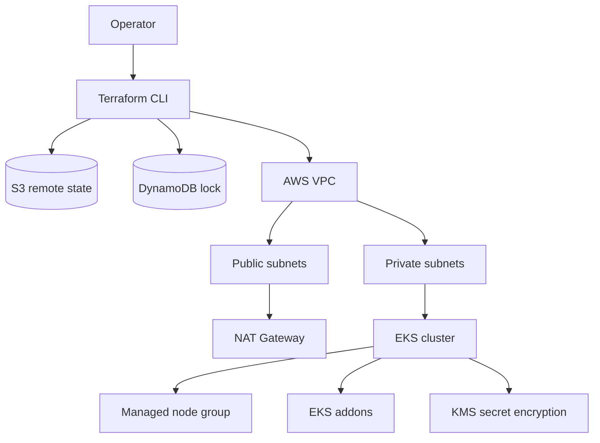
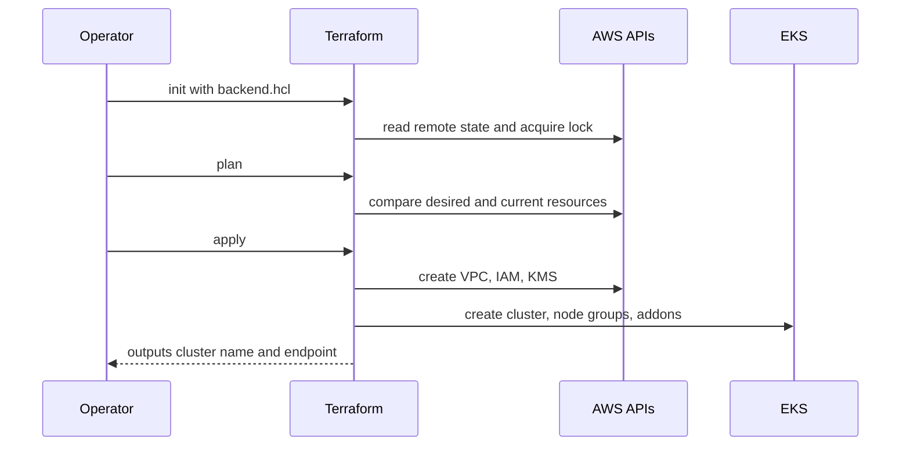

# Terraform Infrastructure


This folder provisions AWS infrastructure for the hospital platform.

## Architecture



## Provisioning Workflow



## Structure

```text
terraform/
  environments/
    dev/                 # Development stack
    prod/                # Production stack
  modules/
    network/             # VPC, subnets, NAT, routes
    eks/                 # EKS cluster, node groups, addons
  scripts/               # Helper scripts for backend bootstrap
```

## Prerequisites

- Terraform `>= 1.6`
- AWS CLI v2
- kubectl
- AWS credentials configured with permission to create VPC, EKS, IAM, KMS, S3, and DynamoDB resources

## Backend Bootstrap

Create the S3 state bucket and DynamoDB lock table once:

```powershell
./terraform/scripts/bootstrap-backend.ps1 -BucketName hospital-terraform-state-devops -TableName hospital-terraform-locks -Region us-east-1
```

Or on Linux/macOS:

```bash
./terraform/scripts/bootstrap-backend.sh hospital-terraform-state-devops hospital-terraform-locks us-east-1
```

Then create `backend.hcl` in the environment folder from `backend.hcl.example` and set the real bucket and table names.

## Deploy Dev

```bash
cd terraform/environments/dev
cp terraform.tfvars.example terraform.tfvars
cp backend.hcl.example backend.hcl
terraform init -backend-config=backend.hcl
terraform fmt -recursive
terraform validate
terraform plan -out tfplan
terraform apply tfplan
aws eks update-kubeconfig --region us-east-1 --name hospital-dev-eks
```

## Deploy Prod

```bash
cd terraform/environments/prod
cp terraform.tfvars.example terraform.tfvars
cp backend.hcl.example backend.hcl
terraform init -backend-config=backend.hcl
terraform fmt -recursive
terraform validate
terraform plan -out tfplan
terraform apply tfplan
aws eks update-kubeconfig --region us-east-1 --name hospital-prod-eks
```

## Destroy

Destroy only after removing application load balancers and persistent volumes from the cluster:

```bash
terraform destroy
```

## Notes

- Dev uses one NAT gateway by default to reduce cost.
- Prod uses one NAT gateway per AZ by default.
- Restrict `public_access_cidrs` before using this with real workloads.
- Terraform does not create ECR repositories. Use an existing registry or create repositories from your CI/CD bootstrap process.
- Terraform does not store application secrets; create Kubernetes secrets separately or with an external secret manager.
