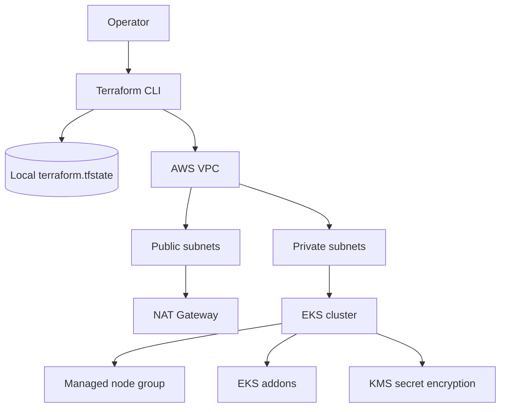
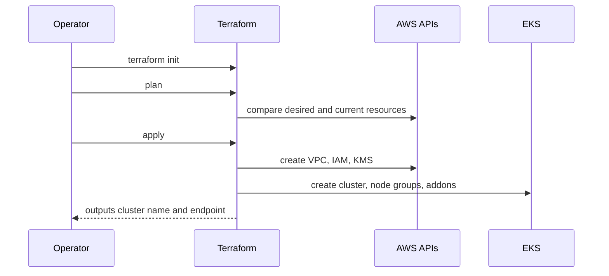

# Terraform Infrastructure


This folder provisions AWS infrastructure for the hospital platform.

## Learning Map

| Topic | What to study here |
|---|---|
| Environment separation | `terraform/environments/dev` and `terraform/environments/prod`. |
| Module design | Shared `network` and `eks` modules. |
| EKS foundation | Cluster, managed node groups, addons, IAM roles, and KMS secret encryption. |
| Network foundation | VPC, public/private subnets, route tables, and NAT gateway strategy. |
| Cost tradeoff | Dev uses a single NAT gateway; prod can use one NAT gateway per AZ. |

## Architecture



## Provisioning Workflow



## Structure

```text
terraform/
  environments/
    dev/                 # Development stack
    prod/                # Production stack
  modules/
    network/             # VPC, subnets, NAT, routes
    eks/                 # EKS cluster, node groups, addons
```

## Prerequisites

- Terraform `>= 1.6`
- AWS CLI v2
- kubectl
- AWS credentials configured with permission to create VPC, EKS, IAM, and KMS resources

## Deploy Dev

```bash
cd terraform/environments/dev
cp terraform.tfvars.example terraform.tfvars
terraform init
terraform fmt -recursive
terraform validate
terraform plan -out tfplan
terraform apply tfplan
aws eks update-kubeconfig --region us-east-1 --name hospital-dev-eks
```

## Deploy Prod

```bash
cd terraform/environments/prod
cp terraform.tfvars.example terraform.tfvars
terraform init
terraform fmt -recursive
terraform validate
terraform plan -out tfplan
terraform apply tfplan
aws eks update-kubeconfig --region us-east-1 --name hospital-prod-eks
```

## Destroy

Destroy only after removing application load balancers and persistent volumes from the cluster:

```bash
terraform destroy
```

## Notes

- Dev uses one NAT gateway by default to reduce cost.
- Prod uses one NAT gateway per AZ by default.
- Terraform uses local state by default in this lab setup.
- Keep the EKS API endpoint private by default. If public endpoint access is required, restrict `public_access_cidrs` to approved public IP ranges.
- Terraform does not create ECR repositories. Use an existing registry or create repositories from your CI/CD bootstrap process.
- Terraform does not store application secrets; create Kubernetes secrets separately or with an external secret manager.
